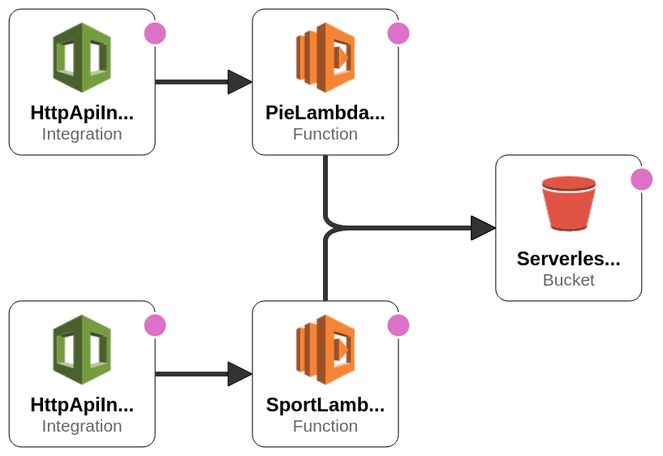

# Birthday Pie for Pandemic Times!

## Fun project to celebrate my birthday with a pie fresh from AWS stack

One lambda to serve a pie, one to save you exercising. Common S3 bucket to host csv files with pies and sports.



## Feel free to grab one

1. Configure AWS / serverless
1. Prepare lambda layer

```
$ mkdir -p layer/nodejs
$ cd layer/nodejs
$ mkdir node_modules
$ npm install --save lodash
```
1. Deploy to AWS
```
sls deploy
```